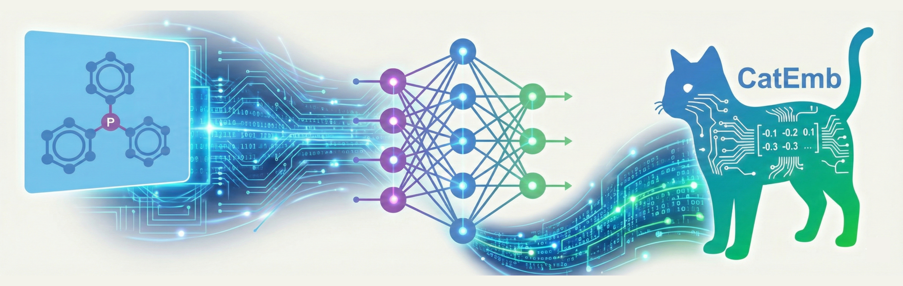

# CatEmb
[](https://ubuntu.com/) [](https://www.python.org/) [](https://pytorch.org/) [](https://pytorch-geometric.readthedocs.io/) [](https://www.rdkit.org/) [](https://opensource.org/licenses/MIT)

Official implementation of *"Stereoelectronic-aware catalyst embeddings from 2D graphs via 2D-3D multi-view alignment"*. The corresponding paper is under review. Preprint version is available at [ChemRxiv](https://chemrxiv.org/doi/full/10.26434/chemrxiv.15000279/v1).

CatEmb​ is a novel, stereoelectronic-aware molecular descriptor that generates compact, fixed-length embeddings directly from 2D molecular graphs (e.g. SMILES). It bridges the gap between readily accessible 2D structural inputs and the decisive 3D stereoelectronic properties essential for data-driven catalyst discovery.



## ✨ Features
* **From 2D to 3D Properties:** Generates molecular embeddings that implicitly capture 3D geometric and energetic information using only 2D graphs as input (for user, it is just SMILES).
* **End-to-End Automation:** Eliminates the need for manual feature engineering, conformational searches, or expensive quantum-chemical calculations during inference.
* **Chemically Intuitive:** The learned embedding space provides a chemically meaningful similarity metric, effectively differentiating ligand classes based on subtle stereoelectronic variations.
* **Ready for Prediction:** Functions as a powerful molecular feature to enhance Quantitative Structure-Performance Relationship (QSPR) models for predicting catalytic outcomes.
* **Accelerates Discovery:** Enables efficient, similarity-based catalyst recommendation strategies for high-throughput experimentation and virtual screening.


## Installation
**1. Clone the repository**
```bash
git clone https://github.com/licheng-xu-echo/CatEmb.git
cd CatEmb
```
**2. Download pretrained model weights**
Download the trained CatEmb model [weights](http://doi.org/10.6084/m9.figshare.31375579) (`model_path.tar.gz`) and extract the archive. Place the extracted folder (model_path/) into the project's `catemb` directory.
```
CatEmb/
├── catemb/
│   ├── model_path/
│   │   └── dim32LN/          # Contains the trained model checkpoints
│   ├── __init__.py
│   ├── data.py
│   └── ... (other source files)
├── requirements.txt
├── setup.py
└── ...
```
**3. Set up the environment and install**

We recommend using `conda` to manage the environment.
```
# Create and activate a new conda environment
conda create -n catemb python=3.12
conda activate catemb

# Install dependencies from requirements.txt
pip install -r requirements.txt -f https://data.pyg.org/whl/torch-2.6.0+cu124.html --extra-index-url https://download.pytorch.org/whl/cu124

# Install the catemb package in development mode
pip install -e .
```

## Basic usage

```python
from catemb import CatEmb
catemb_calc = CatEmb(device='cpu')
cat_smi_lst = ['CN(C)c1ccc(P(C2CCCCC2)C2CCCCC2)cc1',
               'COc1ccc(OC)c(P(C2CCCCC2)C2CCCCC2)c1-c1c(C(C)C)cc(C(C)C)cc1C(C)C']
desc = catemb_calc.gen_desc(cat_smi_lst)
```

## Dataset download
The `CatCompDB`​ dataset used in this project is available for download via [Figshare](http://doi.org/10.6084/m9.figshare.31375579). Place the extracted folder (dataset/) and put it in the `CatEmb` folder.

```
CatEmb/
├── catemb/
├── dataset/
│   │   ├── processed/
│   │   └── rxn_data/
│   └── ...
├── requirements.txt
├── setup.py
└── ...
```

It consists of three key files, representing different stages of the dataset construction pipeline:
1. `original_smiles.npy`: The initial curated dataset containing 12,797​ molecules.
2. `lig_cat_dataset_new.npy`: The expanded dataset (66,664​ molecules) after algorithmically generating ligand-metal complexes.
3. `catcompdb.npy`: The final, refined dataset (62,755​ entries) containing structures optimized with xTB and filtered for convergence.
Additionally, there are some reaction dataset for benchmark.

## Train model
If you want to train your own model, you can use the following command:
```
python train.py --batch_size 4 --epoch 100 --tag test
```
More arguments and their instructions can be found in the `train.py` file.

## Notebooks
This repository includes several Jupyter notebooks that demonstrate key functionalities and analyses:

* **build_dataset.ipynb**: Walks through the process of building the CatCompDB dataset from raw data.
* **ligand_analysis.ipynb**: Shows how to use CatEmb descriptors with t-SNE for visualizing and analyzing ligand clustering in chemical space.
* **qspr_*_catemb.ipynb**: Demonstrates how incorporating CatEmb descriptors as features for catalysts/ligands can improve the accuracy of quantitative structure-performance relationship (QSPR) models.
* **ligand_recommend.ipynb**: Implements a catalyst recommendation strategy based on CatEmb similarity (random and model-based methods are also included), useful for prioritizing experiments in high-throughput screening.

## Citation

Li-Cheng Xu, Fenglei Cao, Yuan Qi. Stereoelectronic-aware catalyst embeddings from 2D graphs via 2D-3D multi-view alignment. *ChemRxiv* **2026** DOI: 10.26434/chemrxiv.15000279/v1
```
@article{xu_2026_catemb,
    author = {Li-Cheng Xu  and Fenglei Cao  and Yuan Qi },
    title = {Stereoelectronic-aware catalyst embeddings from 2D graphs via 2D-3D multi-view alignment},
    journal = {ChemRxiv},
    volume = {2026},
    number = {0222},
    pages = {},
    year = {2026},
    doi = {10.26434/chemrxiv.15000279/v1},
    URL = {https://chemrxiv.org/doi/abs/10.26434/chemrxiv.15000279/v1},
    eprint = {https://chemrxiv.org/doi/pdf/10.26434/chemrxiv.15000279/v1}
}
```